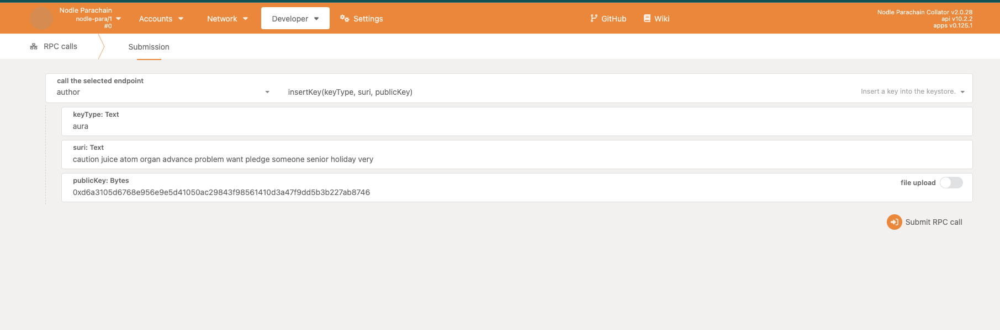
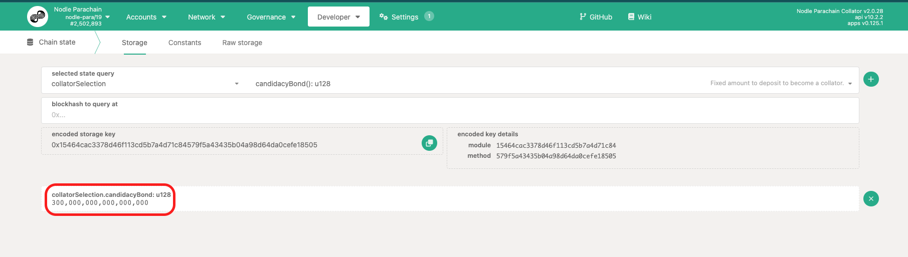
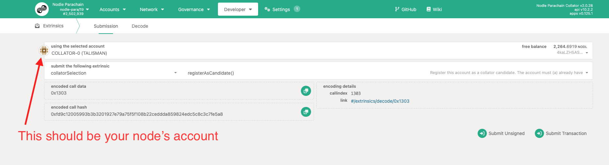
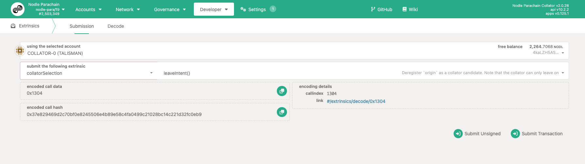

# Running Collator Node

This document provides information on running a collator node, including the definition of a collator node, resource requirements, and steps to run and connect to the node. It also covers how to insert an author key, register as a candidate, and leave intent.  The primary audience for this document are system operators interested in running a collator node to collect transaction fees and optional tips.

## What is a collator node?
Collators are the Nodle Parachain block producers. They are responsible for creating new blocks and adding them to the chain.

In other words collators are parachain nodes with special responsibility to aggregate parachain transactions into blocks and then propose them to the relay chain validators for finalization. Collators do not contribute to network security and only fill the role of a proposer and aggregator. Collators in theory have a power to censor transactions by not including them in their block proposals. However they cannot stop other collators to include any transactions. One main motivation for running a collator node is to collect transaction fees and optional tips.

## Resource Requirements

### Reference Hardware

The transaction weights are benchmarked on a reference hardware. Our reference hardware is a **c2d-highcpu-8** VM instance of the Google Cloud Platform. The transaction weights are then used for calculating the base fees for those transactions. It is recommended that the hardware you use to run the collators at least matches the specs of the reference hardware in order to ensure they are able to process all blocks in time. 

If you want to use your own machine then consider the following specs as a best practice suggestion:

### CPU

x86-64 compatible; Intel Ice Lake, or newer (Xeon or Core series); AMD Zen3, or newer (EPYC or Ryzen); 4 physical cores @ 3.4GHz; Simultaneous multi-threading disabled (Hyper-Threading on Intel, SMT on AMD); Since block production is almost entirely single threaded, single-threaded performance is more important than a higher core count, as this application is not able to utilize the extra resources.

### Storage

Currently (Apr 2023), nodle collator have archived near 300 G and this will grow. So an NVMe SSD of 1 TB is a right choice. The other option could be cloud storage that you can size it to deal with Blockchain growth. 

### Memory

16GB DDR4 ECC. System Linux Kernel 5.16 or newer.

### Network

The minimum symmetric networking speed is set to 500 Mbit/s (= 62.5 MB/s).

## Run Your Node

Check the official release of the Nodle code at [https://github.com/NodleCode/chain/releases](https://github.com/NodleCode/chain/releases). Take the latest release (at the time of writing this doc it was 2.0.29). Give whatever name that you want to your collator (Here we go with my-collator-1). You can go with the same or different name for the side of your collator that is interacting with the relay chain (Here we go with my-relay-1). We’d suggest using docker with a command similar to the following for the initial setup:

```bash
docker run -p 9944:9944 -it nodlecode/chain:2.0.29 --chain eden --collator \
  --force-authoring --rpc-cors all --ws-port=9944 \
  --name my-collator-1 \
  -- \
  --ws-port 9955 --name=my-relay-1 --chain=polkadot
```

## Wait For Sync

Syncing is when your node retrieves the previous blocks of the chain from the discovered peers. Every parachain collator needs to be synced with both the parachain blocks and relaychain blocks before it can collate a new block itself. A collator needs to have all the history which means syncing could take a long time (a matter of few days). Some Node As A Service providers such as OnFinality may offer lightning sync which means they use a backed up storage of a node to bring up another node very quickly. Here is an example of log lines you would see from the output console of you node when its fully synced on both the parachain and the relay chain side:

```bash
2023-04-19 08:01:40 [Parachain] 💤 Idle (11 peers), best: #2503390 (0x50f9…907d), finalized #2503389 (0x58c2…4abc), ⬇ 0.1kiB/s ⬆ 0.3kiB/s
2023-04-19 08:01:41 [Relaychain] 💤 Idle (40 peers), best: #15155998 (0xfb05…51b0), finalized #15155996 (0x7256…473a), ⬇ 377.5kiB/s ⬆ 444.5kiB/s
```

## Connect To Your Node

To be able to connect to your need for the special operations that we talk about in the next section, you need to **stop your node** and bring it up again by adding the following switch to your run command temporarily  `--rpc-methods=Unsafe -unsafe-ws-external`. This means your run command would look like:

```bash
docker run -p 9944:9944 -it nodlecode/chain:2.0.29 --chain=eden \
	--collator --force-authoring \
	--rpc-cors=all --rpc-methods=Unsafe --unsafe-ws-external --ws-port=9944 \
	--name my-collator-1 \
	-- \
	--chain=polkadot --ws-port 9955 --name=my-relay-1
```

Then if you are running your node locally, you can connect to it using either [Nodle Portal](https://nodleprotocol.io/?rpc=ws%3A%2F%2F127.0.0.1%3A9944#/explorer) or [Polkadot/Substrate Portal](https://polkadot.js.org/apps/?rpc=ws%3A%2F%2F127.0.0.1%3A9944#/explorer) . But if you are using a cloud based platform, you’d need to find out the API endpoint to your node through your service provider and use that as a custom development endpoint inside [Nodle Portal](https://www.notion.so/Updating-NodleProtocol-io-Polkadot-JS-3096e86656a2466ea92b0224773923e4) or [Polkadot/Substrate Porta](http://polkadot.js.org/apps)l.

## Insert Author Key

Every collator needs to sign the blocks they create. To give a signature to your collator or in other words assign a wallet to it, you need to have created an account for your node. As an example the secret phrase for the public address of `4myqFaYtCpdy7dkXnJk8rDqPSARgfwYt7CvjBP9jXs2hWXSm` is “**caution juice atom organ advance problem want pledge someone senior holiday very”**. This public address maps to `0xd6a3105d6768e956e9e5d41050ac29843f98561410d3a47f9dd5b3b227ab8746`in hex. To assign this account to your node (**Warning**: never assign this actual address to your node, always create a fresh one), use the step to connect to your node and then go to to **RPC Calls** under the **Developer** menu and select the `author` endpoint to `insertKey` similar to the following screenshot:



**Note**: After this stage you should **stop your node again** and restart it in a safe mode by removing `--rpc-methods=Unsafe -unsafe-ws-external` from the run command.

## **Register As Candidate**

For this stage, the account that you created for your collator node must hold at least 3M NODL tokens plus a bit more to pay for the transaction fees. This amount is currently required to be used as a bond when registering as a collator. This amount may change in the future through the chain’s governance. You can always check what is this amount by using [Nodle Portal](https://nodleprotocol.io/?rpc=wss%3A%2F%2Fnodle-parachain.api.onfinality.io%2Fpublic-ws#/chainstate) and then go to chain state under the Developer menu. Then select collatorSelection > candidacyBond as shown below:



**Note**: Here you don’t need to connect to your own node. You can use a trusted public rpc endpoint such as `wss://nodle-parachain.api.onfinality.io/public-ws` or a light client connection.

If your node’s account has the above amount then you can use that wallet to register as a candidate through [Nodle Portal](https://nodleprotocol.io/?rpc=wss%3A%2F%2Fnodle-parachain.api.onfinality.io%2Fpublic-ws#/extrinsics). Then go to the Extrinsics under the Developer menu and submit a registerAsCandidate transaction from collatorSelection pallet as shown below:



**Note**: Again here you don’t need to connect to your own node.

If the above transaction succeeds then the candidacy bond will be reserved in your account and you can not use that amount for any other purpose until you decide you don’t want to run a collator and you want to finish it. The reasons for a failure of registration include but is not limit to:

- Not having enough fund in your account.
- There has been no candidacy vacancy left on the chain. In other words there have been many candidates before you.

**Note 1**: Once you have registered as a candidate, it would take up to 2 sessions (approximately 8 hours) before your node is selected to create blocks and collect fees. Here is an example of the log lines you would see when your node is producing blocks:

```bash
2023-04-19 08:06:18 [Parachain] Starting collation. relay_parent=0x1b48ba8d4194225690c4e404fa6f9a422643a2731f898c018ea9e31ac45ea393 at=0xa5ad4188e87907fa1d8deca4029cc5ffbb49404e947f34a830394879d51c4e20
2023-04-19 08:06:18 [Parachain] 🙌 Starting consensus session on top of parent 0xa5ad4188e87907fa1d8deca4029cc5ffbb49404e947f34a830394879d51c4e20
2023-04-19 08:06:18 [Parachain] 🎁 Prepared block for proposing at 2503415 (1 ms) [hash: 0xa197996f68bcc588f924e9861e0dd50d64baf70c488355e25eb306aea27f8f04; parent_hash: 0xa5ad…4e20; extrinsics (2): [0x83d2…5a0e, 0xaac4…4518]]
2023-04-19 08:06:18 [Parachain] 🔖 Pre-sealed block for proposal at 2503415. Hash now 0xc5411df05378d123b339787bb666aa8ec16a414192c828d5fa750b90e66fa049, previously 0xa197996f68bcc588f924e9861e0dd50d64baf70c488355e25eb306aea27f8f04.
2023-04-19 08:06:18 [Parachain] PoV size { header: 0.181640625kb, extrinsics: 4.638671875kb, storage_proof: 16.2548828125kb }
2023-04-19 08:06:18 [Parachain] Produced proof-of-validity candidate. block_hash=0xc5411df05378d123b339787bb666aa8ec16a414192c828d5fa750b90e66fa049
```

**Note 2:** When you node is selected if it’s not running and thus not creating blocks for an extended period of time, it would be automatically kicked off and your bond would be freed back to you. If your node is kicked off and you have fixed your node’s unavailability issue, you would need to register as a candidate again.

## Leave Intent

If you intend to terminate your service, the best practice is to explicitly unregister your node before stopping your collator. This is both good for you, because you would then free your bond immediately and for the chain because there wouldn’t be any turn given to a collator which is off. To do that, use your node’s account and submit an extrinsic called `leaveIntent` as shown below:



**Note**: ” Leave Intent” may fail if the number of candidates is equal or lower than a certain number which is currently set as 5. This limitation is set due to safety reasons so that the block chain never stops. If leave intent fails, you cannot free your bond by stopping your collator until new collators are available for the chain.